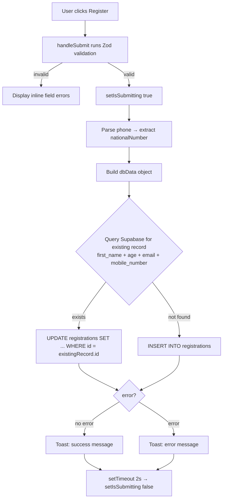

The registration form lives in `app/registration/page.tsx` and is a single-page client component. It uses React Hook Form for state management, Zod for validation, and writes directly to Supabase on submit.

## Libraries used

| Library | Version constraint | Purpose |
|---|---|---|
| `react-hook-form` | — | Form state and submission |
| `@hookform/resolvers/zod` | — | Connects Zod schema to RHF |
| `zod` | — | Runtime validation schema |
| `react-phone-number-input` | — | International phone field with dial-code picker |
| `react-day-picker` | — | Date range picker (wrapped in `LazyDatePicker`) |
| `date-fns` | — | Date arithmetic used by the picker |
| `framer-motion` | — | Entry animations on card and title |

## Zod validation schema

The full schema is defined at the top of `app/registration/page.tsx`:

```typescript
const FormSchema = z.object({
  firstName: z
    .string()
    .min(1, "First name is required")
    .regex(/^[A-Za-z]+$/, "First name must contain only letters"),
  middleName: z
    .string()
    .optional()
    .refine(
      (val) => !val || /^[A-Za-z]+$/.test(val),
      "Middle name must contain only letters"
    ),
  lastName: z
    .string()
    .min(1, "Last name is required")
    .regex(/^[A-Za-z]+$/, "Last name must contain only letters"),
  age: z
    .string()
    .min(1, "Age is required")
    .refine((val) => {
      const num = parseInt(val)
      return !isNaN(num) && num >= 1 && num <= 99
    }, "Age must be a number between 1 and 99"),
  ghaam: z
    .string()
    .min(1, "Ghaam is required")
    .regex(/^[A-Za-z]+$/, "Ghaam must contain only letters"),
  country: z.string().min(1, "Country is required"),
  mandal: z.string().min(1, "Mandal is required"),
  email: emailSchema, // see lib/email-validation.ts
  phoneCountryCode: z.string().min(1, "Phone country code is required"),
  phone: z
    .string()
    .min(1, "Phone number is required")
    .refine(
      (value) => value && isValidPhoneNumber(value),
      { message: "Invalid phone number" }
    ),
  dateRange: z
    .object({
      start: z.any().refine((val) => val !== null, "Arrival date is required"),
      end: z.any().refine((val) => val !== null, "Departure date is required"),
    })
    .refine(
      (data) => {
        if (data.start && data.end) {
          return data.end.compare(data.start) >= 0
        }
        return true
      },
      { message: "Departure date must be on or after arrival date" }
    ),
})
```

## Email validation

Email is validated through a shared schema in `lib/email-validation.ts`. It applies three checks in sequence:

```typescript
export const emailSchema = z
  .string()
  .min(1, "Email is required")
  .email("Invalid email address")
  .refine(
    (email) => {
      const tld = extractTld(email)
      if (!tld) return false
      return TLDs.isValid(tld)
    },
    {
      message:
        "Please check your email domain (e.g. use .com not .clm). Enter a valid email address.",
    }
  )
```

The TLD is extracted from the domain suffix and validated against the `global-tld-list` package, which mirrors the IANA root zone database. This catches common typos such as `.clm` instead of `.com`.

## Form fields reference

### Personal details

<ParamField body="firstName" type="string" required>
  Registrant's first name. Must contain letters only (`/^[A-Za-z]+$/`). Stored as `first_name`.
</ParamField>

<ParamField body="middleName" type="string">
  Optional middle name. Must contain letters only if provided. Stored as `middle_name` (null when omitted).
</ParamField>

<ParamField body="lastName" type="string" required>
  Registrant's last name. Must contain letters only. Stored as `last_name`.
</ParamField>

<ParamField body="age" type="string" required>
  Age as a string input, parsed to an integer (1–99) before storage. Stored as `age` (integer).
</ParamField>

<ParamField body="ghaam" type="string" required>
  Ghaam name. Must contain letters only. Stored as `ghaam`.
</ParamField>

### Location

<ParamField body="country" type="string" required>
  Country of origin. Accepted values: `australia`, `canada`, `england`, `india`, `kenya`, `usa`. Stored as lowercase. Changing this field resets or auto-fills `mandal`.
</ParamField>

<ParamField body="mandal" type="string" required>
  Mandal affiliation. For India, Australia, Canada, and Kenya this is auto-set and the field is disabled. For England and USA a dropdown is shown. Stored as kebab-case (e.g. `new-jersey`). Changing `country` clears this field.
</ParamField>

### Contact

<ParamField body="email" type="string" required>
  Email address validated against the IANA TLD list via `lib/email-validation.ts`. Stored as `email`.
</ParamField>

<ParamField body="phone" type="string" required>
  International phone number entered via `react-phone-number-input`. Validated with `isValidPhoneNumber()`. The national number is extracted with `parsePhoneNumber()` before storage. Stored as `mobile_number`.
</ParamField>

<ParamField body="phoneCountryCode" type="string" required>
  E.164 country calling code (e.g. `+1`). Set automatically from the parsed phone number. Stored as `phone_country_code`.
</ParamField>

### Travel dates

<ParamField body="dateRange.start" type="CalendarDate" required>
  Arrival date. Must be non-null. Minimum selectable date: `2026-07-23` (from `lib/registration-date-range.ts`). Stored as an ISO 8601 string in `arrival_date`.
</ParamField>

<ParamField body="dateRange.end" type="CalendarDate" required>
  Departure date. Must be on or after `dateRange.start`. Maximum selectable date: `2026-08-08`. Stored as `departure_date`.
</ParamField>

## React Hook Form setup

```typescript
const {
  control,
  handleSubmit,
  formState: { errors },
  setValue,
  watch,
} = useForm<FormData>({
  resolver: zodResolver(FormSchema),
  mode: "onBlur",
  defaultValues: {
    firstName: "",
    middleName: "",
    lastName: "",
    age: "",
    ghaam: "",
    country: "",
    mandal: "",
    email: "",
    phoneCountryCode: "",
    phone: "",
    dateRange: { start: null, end: null },
  },
})
```

Validation mode is `onBlur` — fields are validated when the user leaves them, not on every keystroke.

All inputs are wired via the `<Controller>` render-prop pattern so that custom components (phone input, date picker, selects) integrate cleanly with RHF's controlled field API.

## Phone input integration

`LazyPhoneInput` wraps `react-phone-number-input` and is loaded lazily to keep the initial bundle small. When the user selects a country the phone field's default dial code updates automatically:

```typescript
const getPhoneCountryFromCountry = (country: string) => {
  const countryMap: { [key: string]: string } = {
    australia: "AU",
    canada: "CA",
    england: "GB",
    india: "IN",
    kenya: "KE",
    usa: "US",
  }
  return countryMap[country] || "US"
}
```

When a valid number is entered, `parsePhoneNumber()` splits the value into country code and national number. The country code is written to `phoneCountryCode` and only the national number is stored in Supabase.

## Date picker integration

`LazyDatePicker` wraps `react-day-picker` with a range-selection mode. The selectable window is defined in `lib/registration-date-range.ts`:

```typescript
export const REGISTRATION_DATE_RANGE = {
  /** Earliest selectable arrival date (YYYY-MM-DD) */
  start: "2026-07-23",
  /** Latest selectable departure date (YYYY-MM-DD) */
  end: "2026-08-08",
} as const
```

The picker returns `CalendarDate` objects (from `@internationalized/date`). Their `.toString()` method produces an ISO 8601 string that is stored directly in Supabase.

## Submission flow



### Submit handler in full

```typescript
const onSubmit = async (data: FormData) => {
  setIsSubmitting(true)

  try {
    // Extract national number from E.164 phone string
    let nationalNumber = data.phone
    if (data.phone && isValidPhoneNumber(data.phone)) {
      try {
        const parsed = parsePhoneNumber(data.phone)
        if (parsed) nationalNumber = parsed.nationalNumber
      } catch {
        // Failed to parse – use raw value
      }
    }

    const dbData = {
      first_name: data.firstName,
      middle_name: data.middleName || null,
      last_name: data.lastName,
      age: parseInt(data.age),
      ghaam: data.ghaam,
      country: data.country,
      mandal: data.mandal,
      email: data.email,
      phone_country_code: data.phoneCountryCode,
      mobile_number: nationalNumber,
      arrival_date: data.dateRange.start?.toString(),
      departure_date: data.dateRange.end?.toString(),
    }

    // Upsert logic: check for duplicate before insert
    const { data: existingRecord } = await supabase
      .from("registrations")
      .select("id")
      .eq("first_name", dbData.first_name)
      .eq("age", dbData.age)
      .eq("email", dbData.email)
      .eq("mobile_number", dbData.mobile_number)
      .maybeSingle()

    let error = null

    if (existingRecord) {
      const { error: updateError } = await supabase
        .from("registrations")
        .update(dbData)
        .eq("id", existingRecord.id)
      error = updateError
    } else {
      const { error: insertError } = await supabase
        .from("registrations")
        .insert([dbData])
      error = insertError
    }

    if (!error) {
      const isUpdate = existingRecord !== null
      toast({
        title: isUpdate
          ? `Updated existing registration, ${data.firstName}!`
          : `Successfully registered, ${data.firstName}!`,
        description: "Jay Shree Swaminarayan",
        className: "bg-green-500 text-white border-green-400 shadow-xl font-medium",
      })
    } else {
      toast({
        title: "Registration failed",
        description: error.message,
        className: "bg-red-500 text-white border-red-400 shadow-xl font-medium",
      })
    }
  } catch (error) {
    toast({
      title: "Registration failed",
      description: "Please check your connection and try again.",
      className: "bg-red-500 text-white border-red-400 shadow-xl font-medium",
    })
  } finally {
    setTimeout(() => setIsSubmitting(false), 2000)
  }
}
```

## Error handling

| Scenario | Behaviour |
|---|---|
| Zod validation fails | Inline error messages appear beneath each field after blur |
| Supabase returns an error object | Red toast with `error.message` |
| Network or uncaught exception | Red toast: "Please check your connection and try again." |
| Success (new record) | Green toast: "Successfully registered, [firstName]!" |
| Success (updated record) | Green toast: "Updated existing registration, [firstName]!" |

The submit button shows a spinning `Loader2` icon and the text "Please wait" while `isSubmitting` is `true`. It is disabled during this period to prevent double submission.

## Styling

The page imports `@/styles/registration-theme.css` which defines CSS custom properties under `:root` for all registration UI elements:

```css
:root {
  --reg-bg-main: linear-gradient(to bottom right, rgb(255 247 237), rgb(255 255 255), rgb(254 242 242));
  --reg-bg-button: linear-gradient(to right, rgb(249 115 22), rgb(239 68 68));
  --reg-border-primary: rgb(254 215 170);
  --reg-text-error: rgb(239 68 68);
  --reg-text-success: rgb(34 197 94);
}
```

Key utility classes:

| Class | Purpose |
|---|---|
| `.reg-page-bg` | Orange-to-white-to-red gradient page background |
| `.reg-card` | Frosted-glass card with orange border |
| `.reg-input` | 3.5 rem tall input with backdrop blur |
| `.reg-button` | Orange-to-red gradient submit button |
| `.reg-error-text` | Red inline validation error |
| `.reg-label` | Semi-bold label text |

## FAQ

<AccordionGroup>
  <Accordion title="Why is the page rendered client-side?">
    The component is marked `"use client"` because it uses `useState`, `useEffect`, and browser-only libraries (`react-day-picker`, `react-phone-number-input`). The `mounted` guard prevents a hydration mismatch by returning `null` until after the first render on the client.
  </Accordion>
  <Accordion title="Why does the form write to Supabase directly instead of an API route?">
    The registration table allows anonymous inserts via Supabase Row Level Security policies, so the client SDK can write directly without an API route. This keeps the submission path simple and reduces latency by one network hop.
  </Accordion>
  <Accordion title="How does the mandal field handle countries with only one mandal?">
    When the user selects India, Australia, Canada, or Kenya, `setValue('mandal', ...)` is called immediately with the fixed mandal name and the field is rendered as a disabled `<Input>` showing that value. For England and USA a `<Select>` is rendered with the appropriate list.
  </Accordion>
  <Accordion title="What happens if the date picker returns null?">
    The Zod schema for `dateRange.start` and `dateRange.end` uses `.refine((val) => val !== null, ...)`. If either value is null when the form is submitted, the submit handler is blocked and the error appears in the date picker component.
  </Accordion>
  <Accordion title="How is the phone number stored?">
    The full E.164 string (e.g. `+12015551234`) is validated with `isValidPhoneNumber()` from `react-phone-number-input`. Before writing to Supabase, `parsePhoneNumber()` splits the value and only the national number (e.g. `2015551234`) is stored in `mobile_number`. The country code (e.g. `+1`) is stored separately in `phone_country_code`.
  </Accordion>
</AccordionGroup>
